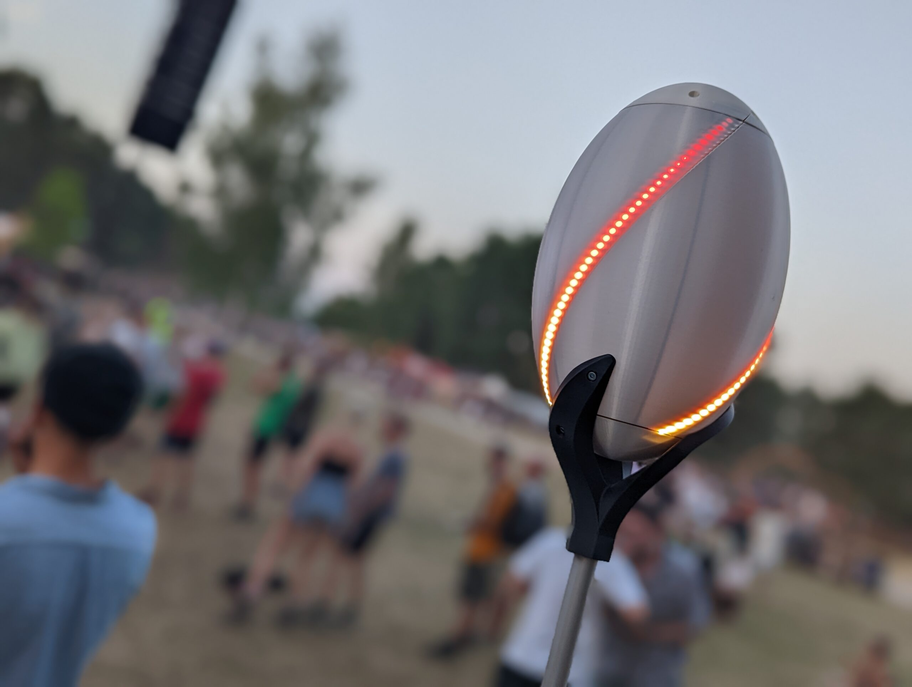
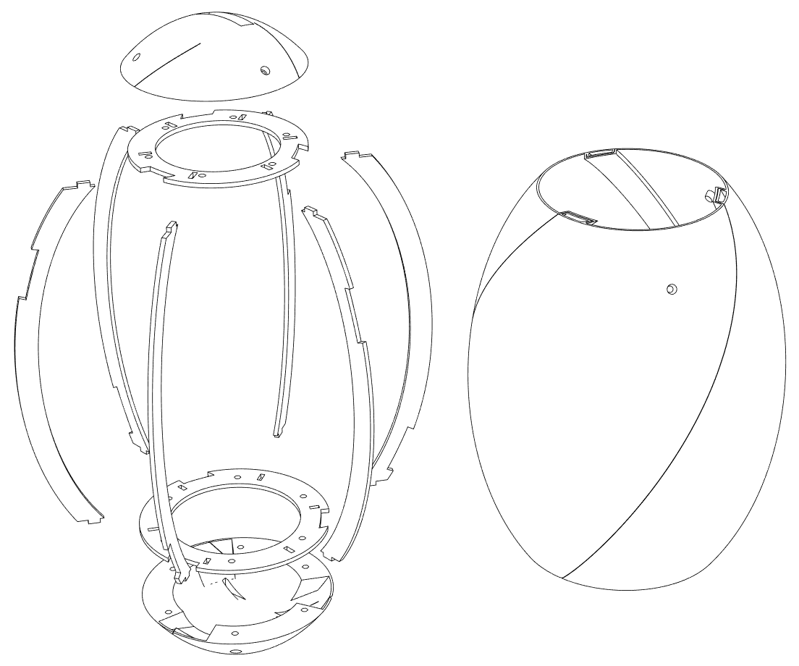
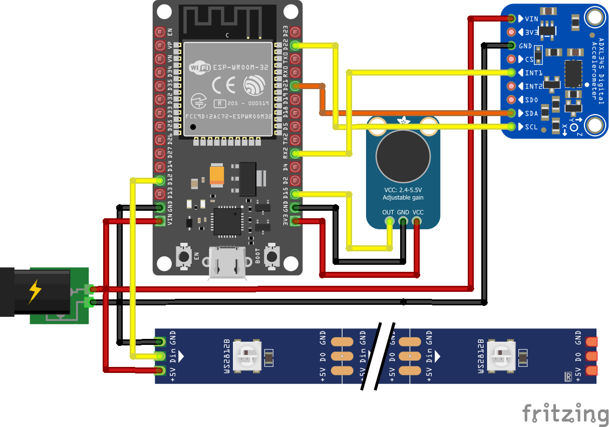

# Fusion egg - An audioreactive festival totem

## Overview

This repository contains software and cad-files for an audioreactive festival totem. This totem is used to find ones crew at a music festival. It listens to the music, detects the beat and translates into a visual animation.

## Structure

## Build
To build your own totem you need the following tools:

- 3D-Printer (z-height min 250mm , Nozzle 0.8mm)
- Laser cutter to cut the internal skeleton of the egg
- Soldering iron

The following parts are needed:

- ESP32 microcontroller board
- Microphone MAX4466
- Accelerometer ADXL345
- WS2812 LED-Stripes (144 leds per meter), for the three stripe egg you need a little bit more than 1 meter. The six stripe egg requires more than 2 meters.
- USB-Powerbank
- Micro USB-Cabel
- Wago Connectors 221-415
- Cables
- Heat-shrink tubing
- Aluminium Tube (OD 20mm, ID 17mm, 2m long)
- 6 M4x20mm Screws
- 12 M4x15mm Screws
- 18 Heat-set inserts M4x6x6
- 3mm Plywood
- Two colors of PLA (light and dark color)
- Cable-ties

### Optional: LEDs for Indirect Illumination Inside the Egg
For an eye-catching glow effect, you can add high-power (5–10W) LEDs inside the egg. This works best if you do not use the internal skeleton and instead print the vase with thicker walls for added strength. The entire egg will softly illuminate, creating a beautiful visual effect.
I used two LEDs with special red and blue wavelengths. However, you can expand this setup to use RGB or RGBW LEDs if you prefer full-color lighting.
To power the LEDs, I used a step-up converter to generate ~20V for a series of six LEDs. The 20V are PWM-controlled using an N-channel MOSFET.

### 3D Printing
For the three stripe version you have to print the following files:
- cad_3stripes/vase.stl (Vase-Mode)
- cad_3stripes/boden.stl 
- cad_3stripes/deckel.stl
- cad_3stripes/klaue.stl

For the six stripe version the folling parts you need the files from the cad_6stripes folder.

### Laser-Cutting
cad_3stripes/lasercutter.pdf contains all parts you need to cut for the 3strip version. 

Assemble the parts with wood glue inside the vase printed part, as showed in this explosion diagramm:

### Electronics
Connect all electronics as showed here:

### Software
Build the sofware inside the firmware folder with PlatformIO. If you need to change the pin assignment for the leds or the microphone, you can find the definitions inside firmware/include/zauberstab.h. Don't forget to flash your eggs.

### Upload / Flash
- Install [VS Code](https://code.visualstudio.com/) and open the `firmware` folder. The PlatformIO extension will install automatically.
- Select your board environment (e.g. `env:nodemcu32s-usb`) from the bottom toolbar in VS Code.
- **USB Upload (`-usb`)**  
  Use this for the initial flash. Connect the device via USB and click the **Upload** button in the bottom toolbar.  
  > Some boards may require holding the **BOOT** button while powering on.
- **WiFi OTA Upload (`-ota`)**  
  After the initial USB flash, you can upload via WiFi. To enter OTA mode, place the egg upside down and power it on — it will blink 3 times to signal it's ready.  
  Connect to the WiFi **FusionEgg-OTA** (password: `12345678`) and press **Upload** in the bottom toolbar.

## License
All software is licensed under GPLv2. Hardware is licensed under CC BY-NC-SA. Contact us for commercial use.

## Contact
You can contact us at tom@binary-kitchen.de and buddhabrot@binary-kitchen.de
