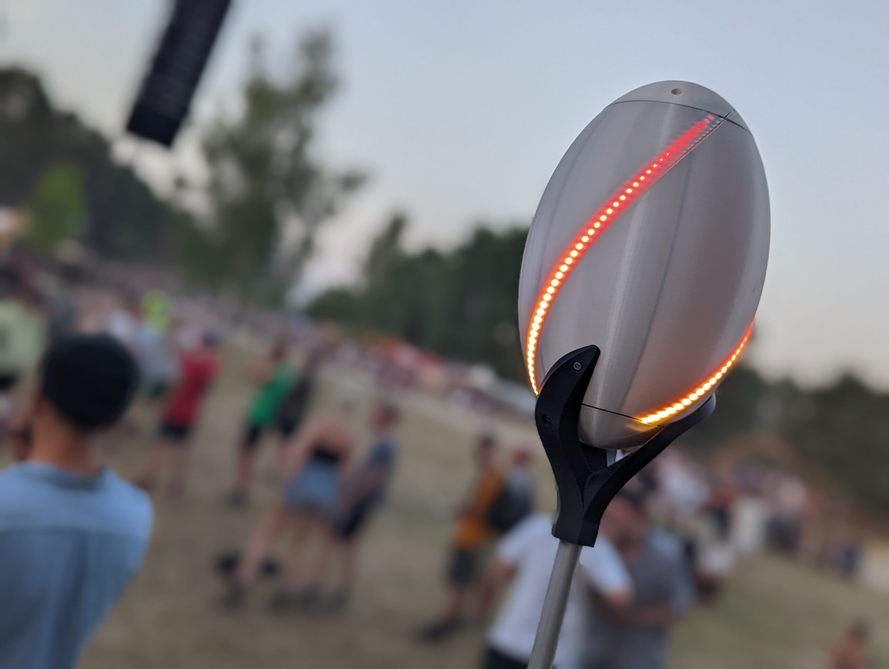
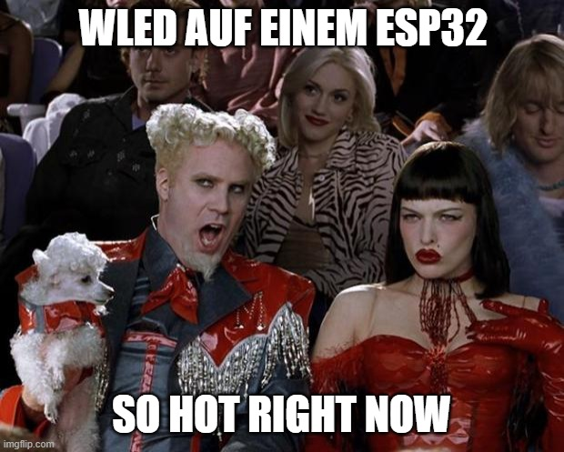
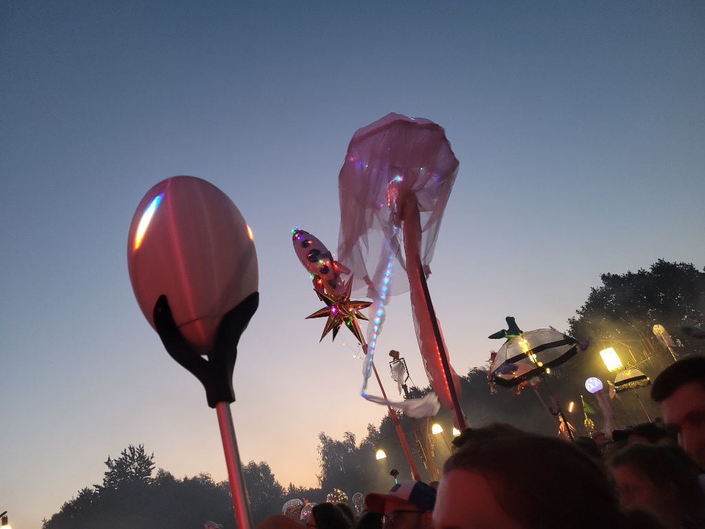

# Praxistest

Nach vielen Nachtschichten waren wir kurz vor dem Festival endlich soweit und hatten zwei funktionierende Eier.
Auch die mehrstündige, ungepolsterte Fahrt in Eurokisten überlebten alle Bauteile problemlos.
Nach einem kurzen Zusammenbau und Funktionscheck kam nun der erste große Test. 

Zu Beginn war das Laufen mit dem Totem noch sehr ungewohnt. Das lag zum einen am hohen Schwerpunkt, zum anderen an der Aufmerksamkeit,
die wir unweigerlich auf uns zogen. 

Eine Warnung an dieser Stelle: Das Totem verwandelt eine Festivalnacht zuverlässig in eine Nerdveranstaltung.
Viele interessierte Menschen kamen auf uns zu und stellten Fragen. 
*Ist das Ding selbst gemacht? Was für einen Mikrocontroller habt ihr dafür genommen? Wo im Netz gibt es die Anleitung dafür? Kannst du meinem Kumpel nochmal das mit dem double-tap zeigen?*
Besonderen Spaß gemacht hat uns der Austausch mit den makern anderer Totems. So verschieden die Basteleien aussahen, so ähnlich
waren doch oft die zugrundeliegenden Lösungen. Auch ein Sommertrend war klar erkennbar:

Am ersten Abend hatten wir zum debugging noch ein vu-Meter auf einem der Eier implementiert um die Aussteuerung zu messen. 
Daraus folgte die wenig überraschende Erkenntnis, dass die Mikrofone wenige Meter vor der Bühne völlig übersteuern. 
Zum Glück funktionierten die audioreaktiven Animationen trotzdem. 

Die Beaterkennung konnte vor allem bei Musik mit gleichmäßigem Rythmus überzeugen, während die Fackelanimation 
vor allem bei bass drops das Umfeld zum Staunen brachte. Der heimliche Star des Abends war jedoch die double-tap-Funktion. 

Vor dem zweiten Abend stellten wir zur Sicherheit noch die Empfindlichkeit der Mikrofone über die kleine Einstellschraube auf den kleinstmöglichen Wert.
Bei der Gelegenheit verringerten wir außerdem die Helligkeit der Animationen.
Weitere Änderungen waren während des Festivals nicht mehr nötig.

Beim Auseinanderbauen stellten wir mit Freude fest, dass die Akkupacks nach einer langen Nacht nicht einmal
die Hälfte ihrer Ladung verloren hatten. Grob geschätzt dürfte die Einsatzdauer bei Benutzung bei etwa einem Tag liegen, 
etwa drei im deep sleep. 

Entsprechend war nun der Zeitpunkt gekommen, wo wir gedanklich vom Tüfelmodus vollständig auf den Festivalmodus umschwenken konnten.
Hier eine Impression von der Tanzfläche, um das Werk in einen Kontext zu setzen:

Wir freuen uns schon auf nächstes Jahr, dann mit Teleskopstab, sowie einer Ladelösung, die kein Aufschrauben mehr nötig macht.

Wenn ihr Lust bekommen habt, dann meldet euch bei uns! Wir sind vor allem interessiert an neuen Animationen, die wir auf das Ei laden können.